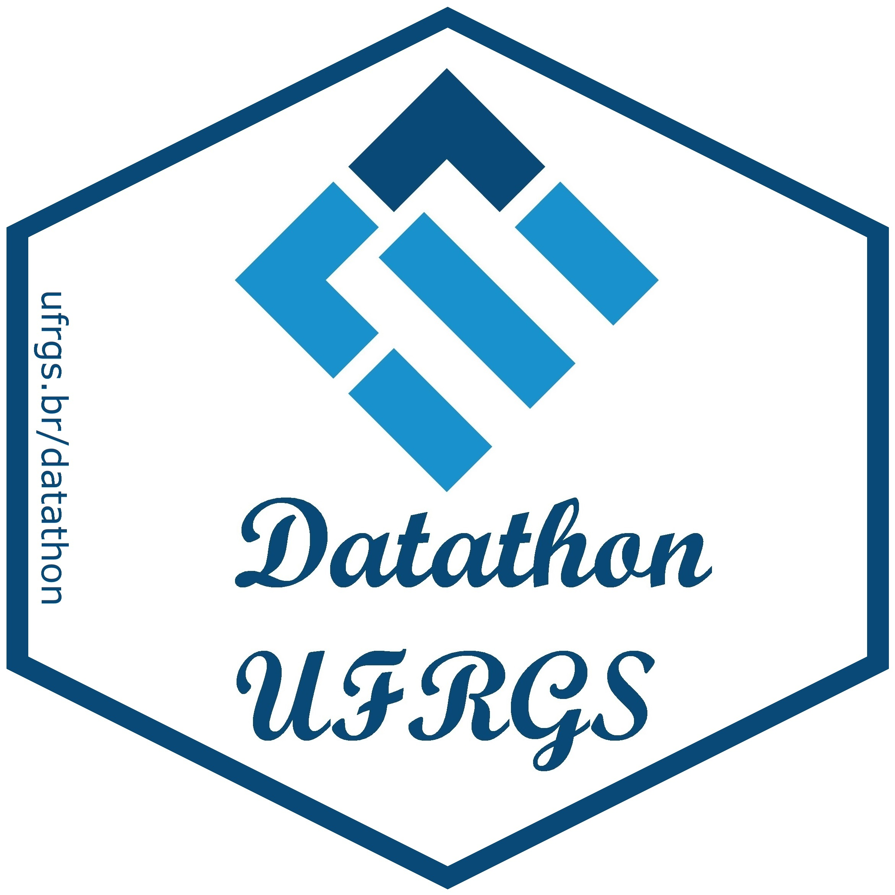
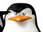

&nbsp;

&nbsp;

O __Datathon UFRGS__ é um espaço pensado por alunos e professores do Departamento de Estatística da UFRGS 
para reunirmos tecnologia e inovação com problemas reais complexos e pessoas criativas interessadas em resolvê-los. 

A palavra _Datathon_ é composta pelos termos _data_ (dados) e _thon_, de _marathon_ (maratona). 
_Datathon_ é uma competição em que os participantes buscam desenvolver soluções, desde a coleta até a sua análise, para um grande volume de dados disponível. 

O evento consisite em trocas de conhecimentos e informações entre os organizadores, 
estudantes e profissionais de diversas áreas do conhecimento, e de diferentes níveis de 
programação computacional. Esperamos criar um ambiente criativo para discussão de 
soluções técnológicas a problemas de obtenção e análise de dados.

&nbsp;

{width=60%}

&nbsp;

Se você acha que pode colaborar conosco de alguma forma na realização desse evento, junte-se a nós!  
Contact us: datathon.ufrgs@gmail.com  

&nbsp;

__Comissão Organizadora do 1º Datathon UFRGS__  

* {width=8%} Profa. Márcia Barbian  

* {width=8%} Prof. Markus Stein  

* {width=8%} Prof. Rodrigo dos Reis  

* {width=8%} Profa. Silvana Schneider

