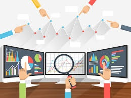
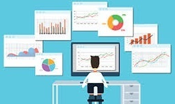
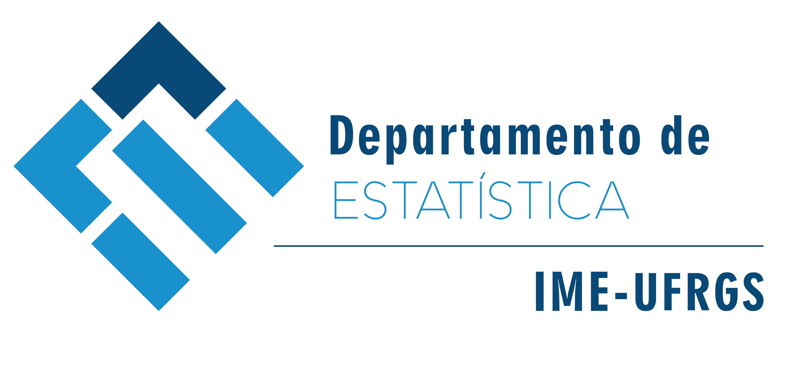
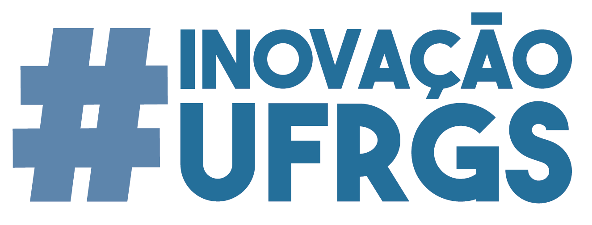

&nbsp;

  
### {width=12%} Eleições 2018 e Visualização de Dados {width=15%}  

  

&nbsp;

O [__Departamento de Estatística__](https://www.ufrgs.br/ime/departamentos/estatistica/){target="_blank"} da UFRGS, __em comemoração dos 40 anos do curso de Bacharelado em Estatística__ e dentro das atividades da [__Semanística__](http://www.ufrgs.br/semanistica){target="_blank"}, convida toda a comunidade acadêmica, e demais interessados em análise de dados, a participar do __1º Datathon da UFRGS__. 

O __1º Datathon da UFRGS__ é um evento que visa proporcionar a estatísticos, matemáticos, cientistas da computação, cientistas políticos, jornalistas, publicitários, _designers_, programodores, _hackers_ e todas as pessoas criativas engajadas, a criação colaborativa de soluções tecnológicas principalmente a partir do [repositório de dados eleitorais do __Tribunal Superior Eleitoral__ (TSE)](http://www.tse.jus.br/eleicoes/estatisticas/repositorio-de-dados-eleitorais-1){target="_blank"}. Será uma maratona de análise de dados em que as equipes irão propor alternativas para que dados eleitorais sejam disponibilizados com transparência e acessibilidade a qualquer cidadão.

O evento acontece de 15 a 17 de outubro, no [Departamento de Estatística, Campus do Vale - UFRGS](local.html). Além da maratona de dados, a [__programação__](programa.html) contará com __palestras__ e __oficinas__ de programação estatística utilizando o software [__R__](https://www.r-project.org/){target="_blank"}:

- _Web scraping_;
- visualização de dados e o pacote _ggplot2_: gráficos estáticos x interativos;
- visualização de dados: mapas para dados georreferenciados;
- relatórios via _Rmarkdown_.

__Comece a pensar em sua proposta!__ Ênfase será dada a soluções de visualização 
de dados com o objetivo de facilitar a acessibilidade dos resultados a qualquer 
cidadão. Também são bem-vindas propostas de ferramentas de busca nas bases do TSE, 
integração com outras bases de dados públicos e projeção de votos. __Use a sua imaginação__! 
Veja aqui alguns [Exemplos de propostas](links.html).

__Convide seus colegas e amigos!!!__ Encorajamos grupos mistos de participantes com 
diferentes níveis de experiência em programação computacional e de diferentes áreas 
do conhecimento. __SEE YOU THERE!!!__

&nbsp;

__Calendário:__  

Data  | Atividade
------|---------------------------------------
15/09 | Abertura das inscrições - [__INSCRIÇÕES__](programa.html)
15/10 | Oficina de apresentação do 1º Datathon
15/10 - 16/10 | Datathon
17/10 | Pitch - apresentação das soluções e premiação

&nbsp;

<!-- __Realização:__   -->
<!-- [{width=50%}](https://www.ufrgs.br/ime/departamentos/estatistica/){target="_blank"} -->

__Realização:__  
[{width=90%}](https://www.ufrgs.br/ime/departamentos/estatistica/){target="_blank"}  

__Apoio:__  
[{width=70%}](https://www.ufrgs.br/inovacao/campanha-inovacao-ufrgs/){target="_blank"}

