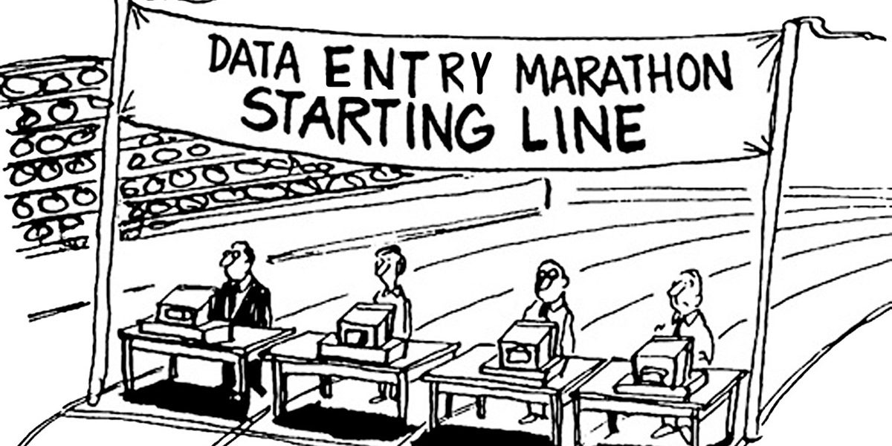
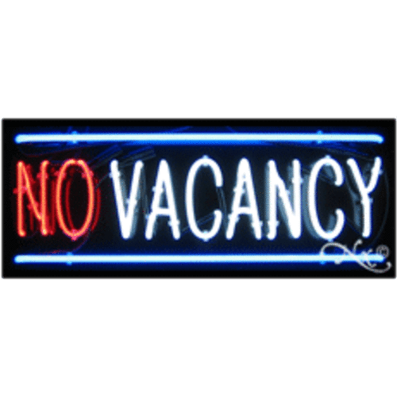

{width=20%} 

&nbsp;

Em sua primeira edição, o __Datathon UFRGS__ ocorrerá em parceria com a 
Semana Acadêmica da Estatística [(Semanística)](http://www.ufrgs.br/semanistica){target="_blank"}. 
As atividades programadas para o turno da manhã serão realizadas conjuntamente entre os eventos.

Convidamos os interessados em participar das demais atividades da Semanística a se inscreverem no Datathon UFRGS através da [página de inscrições da Semanística](https://docs.google.com/forms/d/e/1FAIpQLSeArSz8umdJAAPh-Dv_ylawHZ8Tx_p96-57RJNR6MY_vTGXLg/viewform?c=0&w=1){target="_blank"}. (Nesse caso não há necessidade de se inscrever através da página do Datathon)  

Inscrições para participação somente no __1º Datathon da UFRGS__ devem ser realizadas [aqui](https://docs.google.com/forms/d/e/1FAIpQLSfkqNJn-8DCuekpgGutO0j-3FtIKdpxQTpqngTE0HfmH1fE-w/viewform){target="_blank"}.  

&nbsp;

A __programação__ do __1º Datathon UFRGS__ será composta por:  

Horário | Segunda (15/10) | Terça (16/10) | Quarta (17/10)    
--------|-----------------|---------------|-----------------  
08:00 as 10:30   |                 |               |                 
coffe-break      |                 |               |                          
11:00 as 12:30   |  [_Oficina 1\*_](#oficina1) [{width=20%}](#oficina1) _e Apresentação do problema_ |               |  _Apresentação de soluções e Premiação\*_   
Lunch            |                 |               |                        
13:00 as 14:00   |  _Entrega das propostas_     |    _Relato de andamento_   |                       
14:00 as 15:30   |  _Maratona_       |    _Maratona_   |                       
coffe-break      |                 |               |                          
16:00 as 16:30   |  [_Oficina 2_](#oficina2)        |    [_Oficina 3_](#oficina3)   |                         
16:30 as 18:00   |  _Maratona_       |    _Maratona_   |                         
*Atividades em conjunto com a Semanística.

&nbsp;

### Oficina 1  {width=15%}  
_\* Agradecemos o interesse de todos, mas devido ao número limitado de vagas não conseguiremos garantir vaga na Oficina 1 para novas inscrições. Uma lista de espera será formada e em caso de enventuais desistências chamaremos os próximos inscritos. Para as demais atividades a vaga estará garantida._  

__Título__: _Pintando e bordando no R: ggplot2 e Rmarkdown_  
__Palestrante__: _Prof. Rodrigo C. P. dos Reis_  
Arquivos da apresentação: [.zip](arquivos_oficina1.zip)

&nbsp;

### Oficina 2   

__Título__: _Web Scrapping, Web Services e API's - Extraindo dados através do R_  
__Palestrante__: _Lucas Godoy (Doutorando em Estatística pela UFMG)_  

&nbsp;

### Oficina 3   

__Título__: _MapeaR: descomplicando a construção de mapas no R_  
__Palestrante__: _Luís G. Silva e Silva (Pós doutorado pela UFMG)_  
Arquivos da apresentação: [.zip](datathon-spatial-v02.zip)

