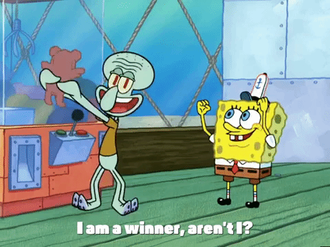
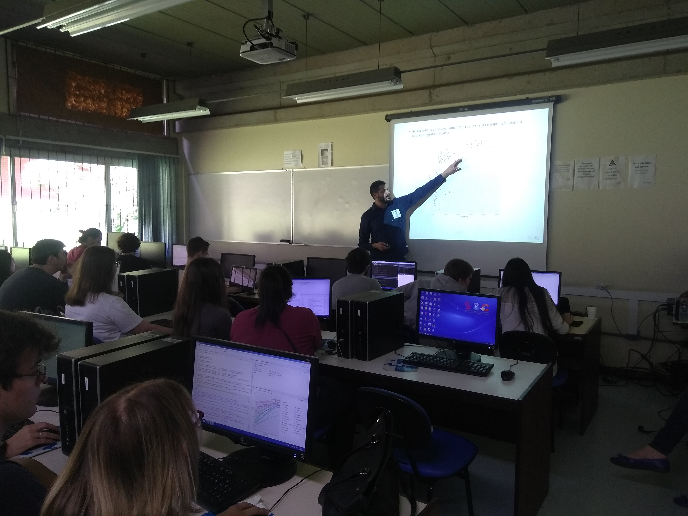
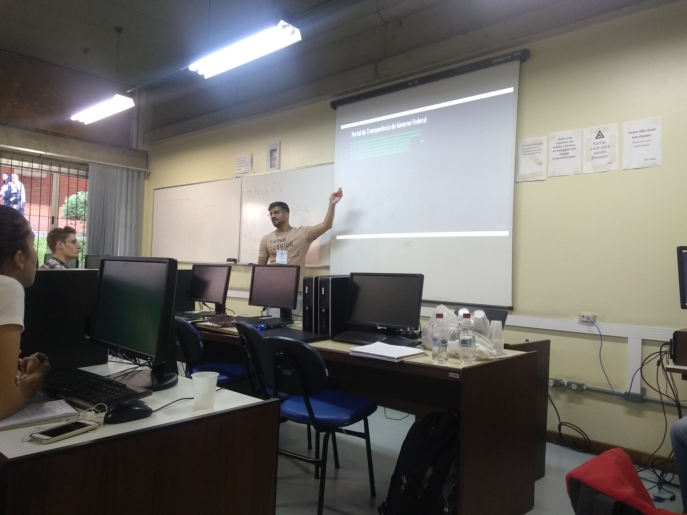
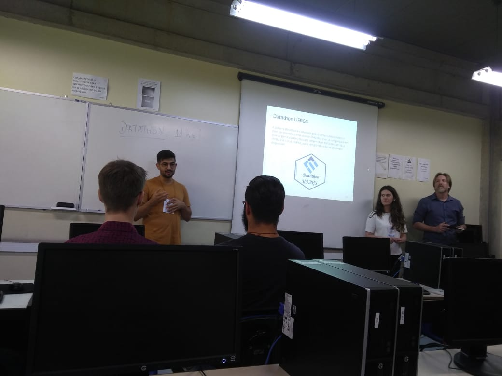
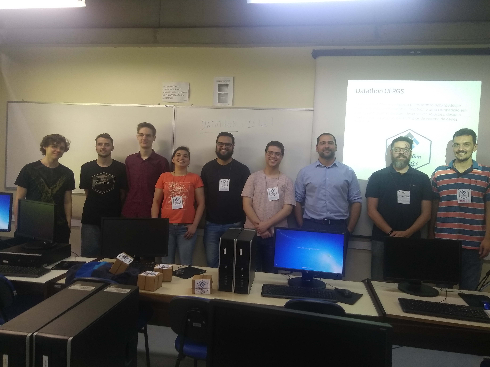
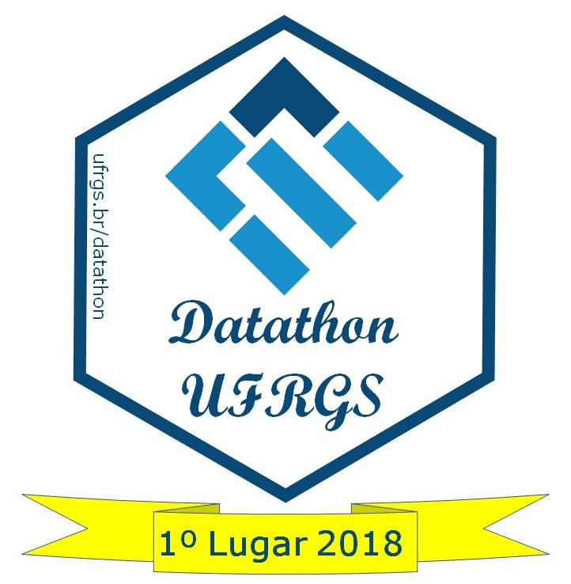
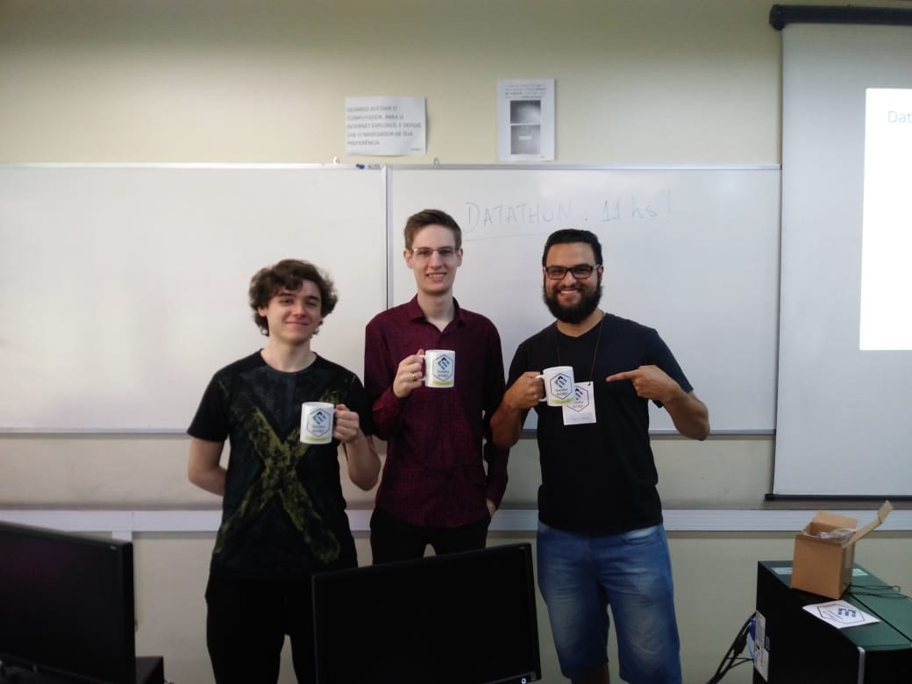
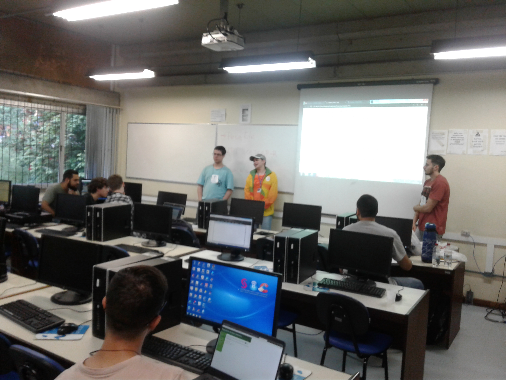

{width=20%}  

&nbsp;

## A maratona

O __1º Datathon da UFRGS__ contou com a participação de estudantes de graduação e pós graduação da matemática, estatística e ciência da computação, divididos em quatro equipes.  
&nbsp;

O primeiro dia iniciou com o minicurso __"Pintando e bordando no R: ggplot2 e Rmarkdown"__ apresentado pelo __Prof. Rodrigo C. P. dos Reis__. Após o minicurso, então, o desafio foi lançado. As equipes foram formadas e dentro do prazo estipulado foram apresentadas as propostas de análises.  

{width=70%}

&nbsp;

Ainda no primeiro dia do evento tivemos o segundo minicurso, intitulado __"Web Scrapping, Web Services e API's - Extraindo dados através do R"__, ministrado por __Lucas Godoy__ (Ex-aluno Estatística/UFRGS, Campeão Datathon CEPESP-FGV).  
&nbsp;

O segundo dia iniciou com uma breve discussão sobre o andamento das análises. Ocorreu também a terceira oficina, ministrada via skype por __Luís Gustavo Silva e Silva__ (Pós doutorado pela UFMG), título __"MapeaR: descomplicando a construção de mapas no R"__. Por fim as equipes receberam instruções sobre o _pitch_ de apresentação das soluções.  

{width=70%}  

&nbsp;

## Resultados
O encerramento do __1º Datathon da UFRGS__ ocorreu com as apresentações dos produtos finais e divulgação do resultado. A primeira equipe a apresentar foi __"Mitos e Verdades"__, seguida pela equipe __"What If"__. As demais equipes relataram problemas na fase final das análises e optaram por não apresentarem seus resultados. 

<!-- 
 -->
<!-- 
 -->
{width=40%} {width=40%}  
<!-- 
 -->

A banca avaliadora foi composta pelo __Prof. Rodrigo Dalla Vechia__ (Departamento de Matemática Pura e Aplicada UFRGS), __Profa. Márcia Barbian__, __Lucas Godoy__ e __Miriam Salinas__(Pós graduação em Computação Aplicada na Engenharia de Software UTFPR). De um modo geral, a avaliação exaltou a boa qualidade dos produtos apresentados apesar do curto prazo para a realização e parabenizaram a todos os participantes.
<!-- 
 -->

&nbsp;

### 1º lugar - Equipe "What If"

<!-- 
 -->
{width=30%} {width=40%} 
<!-- 
 -->

Com o título da proposta "Receitas e Despesas dos partidos políticos", a equipe "What If" foi a campeã do __1º Datathon da UFRGS__. Seus integrantes __Bruna Martini Dalmoro__, __Cristiano Sulzbach__, __Guilherme Malta__ e __Pedro Victor de Medeiros__ fizeram um ótimo trabalho, confira [aqui](Pitch_Datathon_What-IF.pdf){target="_blank"} os slides da apresentação do grupo. 

"O aplicativo tem como objetivo facilitar a visualização dos dados de Receita e Despesas dos candidatos e partidos concorrentes nas Eleições do ano 2014. Simplificando também a pesquisa por um candidato ou partido específico. Uns dos gráficos principais representa a relação receita vs vitória e amostra que candidatos que gastaram mais em campanhas politicas tiveram mais chances de vitória." ([https://medium.com/@michinoguera/explorando-a-1º-datathon-ufrgs-2fabd5621f0d](https://medium.com/@michinoguera/explorando-a-1%C2%BA-datathon-ufrgs-2fabd5621f0d){target="_blank"})

O endereço para o aplicativo é [https://sulzbach.shinyapps.io/datathon/](https://sulzbach.shinyapps.io/datathon/){target="_blank"} (Usuario 'datathon' e Senha 'datathon'). Well done 'What If team'! You guys made it!  

&nbsp;

### 2º lugar - Equipe "Mitos e Verdades"

A equipe "Mitos e Verdades" também está de parabéns pelo belo trabalho apresentado. A equipe composta por __Gabriel Holmer Saul__, __Gustavo Utpott__ e __Priscilla Gnewuch__ apresentou a proposta "Uma análise do 1º turno das eleições presidenciais". Seus resultados podem ser encontrados [aqui](Datathon_mitosEverdades.pdf){target="_blank"}.  

"Os gráficos em mapas divididos por estados representaram especificamente os votos para os candidatos a presidência concorrentes para o segundo turno e permitiram ver que a maioria das pessoas com maior nível de escolaridade votaram pelo candidato Jair Bolsonaro, enquanto o nível de escolaridade dos votantes do candidato Haddad foi heterogêneo ressaltando uma maioria de pessoas com escolaridade baixa." ([https://medium.com/@michinoguera/explorando-a-1º-datathon-ufrgs-2fabd5621f0d](https://medium.com/@michinoguera/explorando-a-1%C2%BA-datathon-ufrgs-2fabd5621f0d){target="_blank"})  

{width=80%}   

&nbsp;

## Agradecimentos
Gostaríamos de agradecer novamente a todos os participantes. Nosso muito obrigado também a banca avaliadora. A participação e colaboração de todos vocês fizeram desse evento um grande sucesso!  

Também agradecemos o apoio:
* Instituto de matemática e Estatística - __IME__;  
* Departamento de Estatística - __DEst__;  
* __Semanística__;  
* __INOVA UFRGS__ ;  
* __Imprensa da UFRGS__.  

&nbsp;

## Aguardem! Novas atividades estão por vir!  

&nbsp;

 Esta obra está licenciada com uma Licença <a rel="license" href="http://creativecommons.org/licenses/by-nc-sa/4.0/">Creative Commons Atribuição-NãoComercial-CompartilhaIgual 4.0 Internacional</a>.
